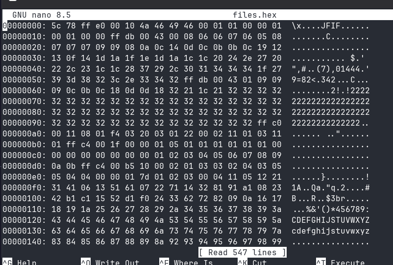
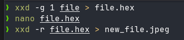
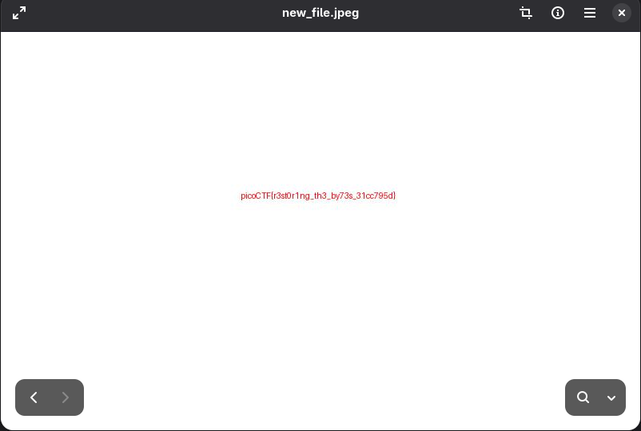

# 🚩 PicoCTF Writeup — [Corrupted File]

> **Author:** [jhaienz]
> **Category:** [Forensics]
> **Difficulty:** [Easy]

---

## 📄 Challenge Description

> _This file seems broken... or is it? Maybe a couple of bytes could make all the difference. Can you figure out how to bring it back to life?_

**Challenge URL:** `https://play.picoctf.org/practice/challenge/519`

---

## 🔍 Approach / Recon

At first I thought it was a normal executable file, but I was wrong. After reading the description, it is corrupted, so I thought, why not look at the byte to fix the corruption?

---

## 🛠️ Tools Used

| Tool   | Purpose                 |
| ------ | ----------------------- |
| [xxd]  | [binary to hexadecimal] |
| [nano] | [text editor]           |

---

## 🧩 Solution

### Step 1:

First, I used the xxd to convert the binary file into hex so that I can read it. I noticed that it says JFIF. Usually, the JFIF header starts with "FF D8 FF," but in here it is different.

### Step 2:

These are the commands I used.

- conversion from binary to hex

- editing the hex file with nano

- converting the hex file to JPEG

### Step 3:

Now I opened the image, and I got the flag at last.

---

---

## 💡 Key Takeaways

I learned how to use the xxd tool and modify some bytes to fix the file.

---

## 📚 References

- [JPEG File Interchange Format](https://en.wikipedia.org/wiki/JPEG_File_Interchange_Format)
- [XXD Tutorial ](https://www.tutorialspoint.com/unix_commands/xxd.htm)

---

_Writeup by [jhaienz] — [Feb 17, 2026]_
