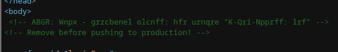
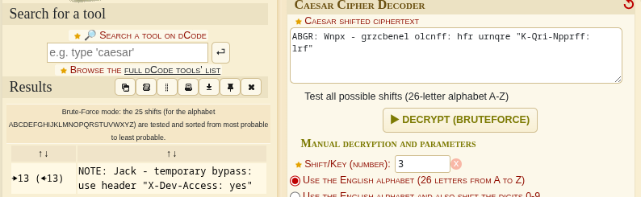
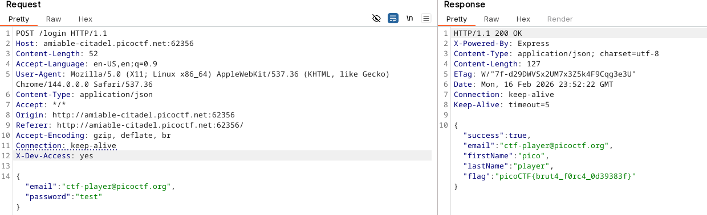

# 🚩 PicoCTF Writeup — [Crack the Gate 1]

> **Author:** [jhaienz]
> **Category:** [Web Exploitation]
> **Difficulty:** [Easy]

---

## 📄 Challenge Description

> _We’re in the middle of an investigation. One of our persons of interest, ctf player, is believed to be hiding sensitive data inside a restricted web portal. We’ve uncovered the email address he uses to log in: ctf-player@picoctf.org. Unfortunately, we don’t know the password, and the usual guessing techniques haven’t worked. But something feels off... it’s almost like the developer left a secret way in. Can you figure it out?_

**Challenge URL:** `https://play.picoctf.org/practice/challenge/520` _(if applicable)_

---

## 🔍 Approach / Recon

My first instinct is whenever it is a web application, I always first look for clues or hints inside the code in inspect elements/view page source and also for tokens in session/cookies/local storage, and I also prepare for Burp Suite.

---

## 🛠️ Tools Used

| Tool         | Purpose            |
| ------------ | ------------------ |
| [Burp Suite] | [Web Exploitation] |

---

## 🧩 Solution

### Step 1:

First, I looked at the page source of the web and noticed a comment that should be removed in prod.

### Step 2:

I copied the comment and then pasted it into the Caesar cipher for decoding the message, and I got the readable message.

### Step 3: [Title]

Now I followed what the message is for Jack, so I captured the request using Burp Suite and added the message to the header to bypass the login page and get the password.

---

## 💡 Key Takeaways

I learned from this challenge to capture and modify the request to bypass weak login pages using Burp.

---

_Writeup by [jhaienz] — [Feb 17, 2026]_
