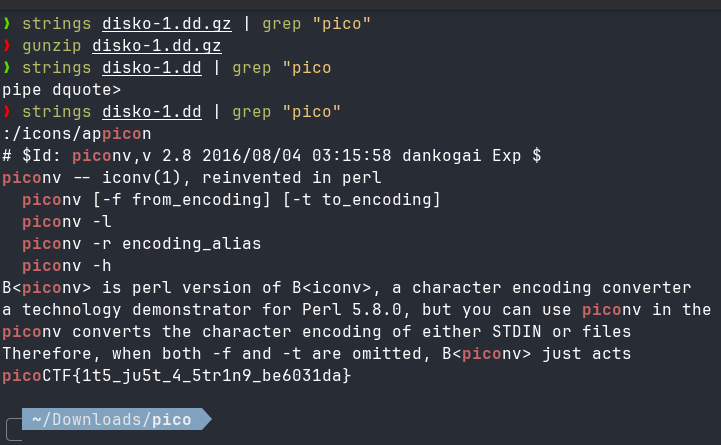

# 🚩 PicoCTF Writeup — [Disko 1]

> **Author:** [jhaienz]
> **Category:** [Forensics]
> **Difficulty:** [Easy]

---

## 📄 Challenge Description

> _Can you find the flag in this disk image?_

**Challenge URL:** `https://play.picoctf.org/practice/challenge/505`

---

## 🔍 Approach / Recon

I thought I was going to find the flag in binary since it said "disk image," but it was just a string, so this was hella easy with few commands.

---

## 🛠️ Tools Used

| Tool      | Purpose                                      |
| --------- | -------------------------------------------- |
| [Gunzip]  | [File Extractor]                             |
| [Strings] | [extract human readable strings from binary] |

---

## 🧩 Solution

### Step 1:

First, I tried to grep the flag, but it was empty. I noticed that the file extension is "gz," and I realized that it was a compressed file.

```bash
# commands you ran
$ strings disko-1.dd.gz | grep "pico"
```

### Step 2:

Extracting the file

```bash
# commands you ran
$ gunzip disko-1.dd.gz
```

### Step 3:

After extracting the i strings and grep-ing the file to get the flag, the gotcha flag was captured!



---

## 💡 Key Takeaways

What I learned from this challenge is to check the file extension; you might miss something.

---

_Writeup by [jhaienz] — [Date]_
