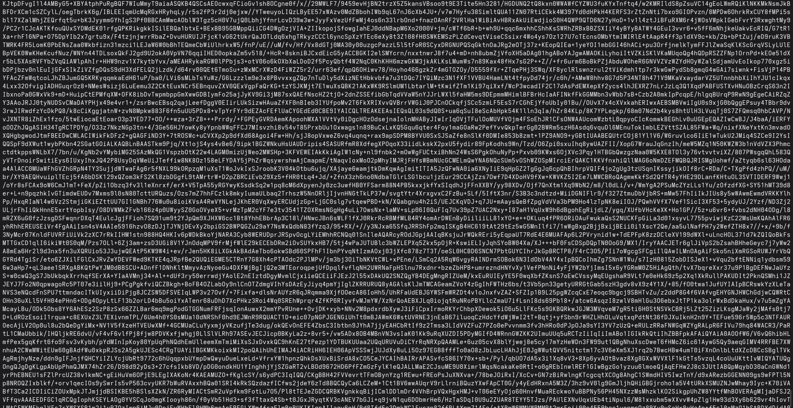
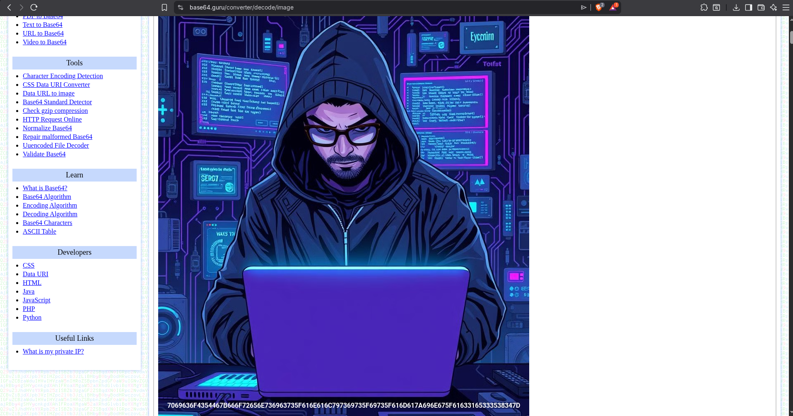
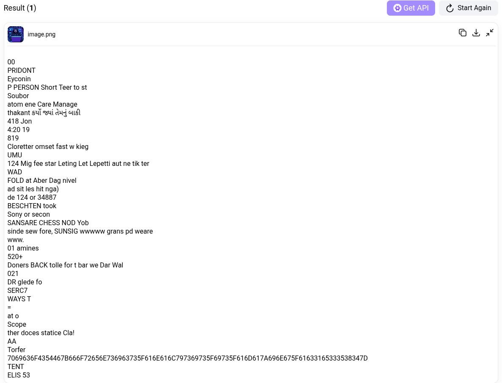
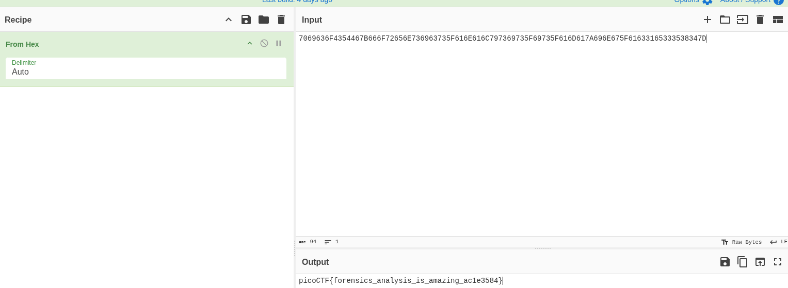

# 🚩 PicoCTF Writeup — [Flag in Flame]

> **Author:** [jhaienz]
> **Category:** [Forensics]
> **Difficulty:** [Easy]

---

## 📄 Challenge Description

The SOC team discovered a suspiciously large log file after a recent breach. When they opened it, they found an enormous block of encoded text instead of typical logs. Could there be something hidden within? Your mission is to inspect the resulting file and reveal the real purpose of it. The team is relying on your skills to uncover any concealed information within this unusual log.
Download the encoded data here: Logs Data. Be prepared—the file is large, and examining it thoroughly is crucial .

**Challenge URL:** `https://play.picoctf.org/practice/challenge/523`

---

## 🔍 Approach / Recon

The challenge gave me a logfile, so I knew I would be dealing with some texts again, so I prepared my grep tool.

---

## 🛠️ Tools Used

| Tool            | Purpose                       |
| --------------- | ----------------------------- |
| [grep]          | [textsearching text patterns] |
| [base64Decode]  | [Decoding/encoding]           |
| [cyberchef]     | [Decoding/encoding]           |
| [image to text] | [text extractor]              |
| [base64 image]  | [converts base64 to image]    |

---

## 🧩 Solution

### Step 1:

So first I cat the file to see what's inside. I noticed that this is base64. I also tried to use "grep PICO," and it did not work; instead, I just copied the whole text.

### Step 2:

After decoding it on a base64 decoder, I noticed that the first 3 letters are "PNG," so I assumed that this encoding is an image.

### Step 3:

After pasting the whole text to base64 to image, I can now view the whole image, and I noticed that there is text on the image itself. I tried using exiftool first to look for clues on metadata, but there were none.

---

### Step 4:

Next, I used the text grabber from the image to get the text from the image.

### Step 5:

I can see that the text I got from the image is hex, so I opened CyberChef to decode the hex and finally got the flag.

---

## 💡 Key Takeaways

My key takeaway for this is to always use available tools online by just searching for their purpose or the problem you want to be solved, such as getting the text from an image.

---

_Writeup by [jhaienz] — [feb 17, 2026]_
