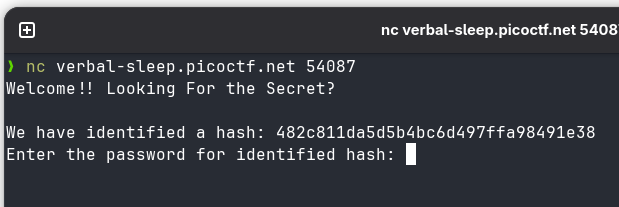

# 🚩 PicoCTF Writeup — [hashcrack]

> **Author:** [Jhaienz]
> **Category:** [Cryptography]
> **Difficulty:** [Easy]
> **CTF Event:** PicoCTF [2025]

---

## 📄 Challenge Description

A company stored a secret message on a server which got breached due to the admin using weakly hashed passwords. Can you gain access to the secret stored within the server?

**Challenge URL:** `https://play.picoctf.org/practice/challenge/475`

---

## 🛠️ Tools Used

| Tool              | Purpose        |
| ----------------- | -------------- |
| [crakstation.net] | [hash cracker] |

---

## 🧩 Solution

### Step 1:

I first netcat to the server and it give me a hash

### Step 2:

i succesfully cracked it at the crackstation.net, and typed the password at the terminal, and it reveals another hash, i did repeat this serveral times until i got the flag

### Step 3:

flag captured

_Writeup by [jhaienz] — [Feb 16, 2025]_
