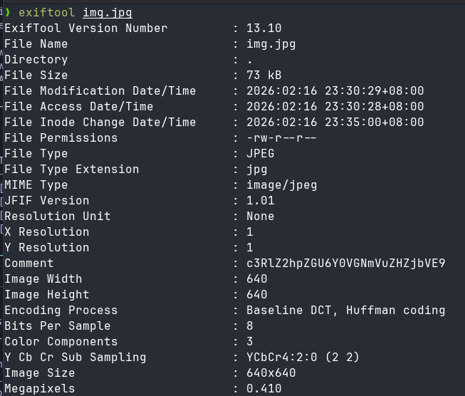
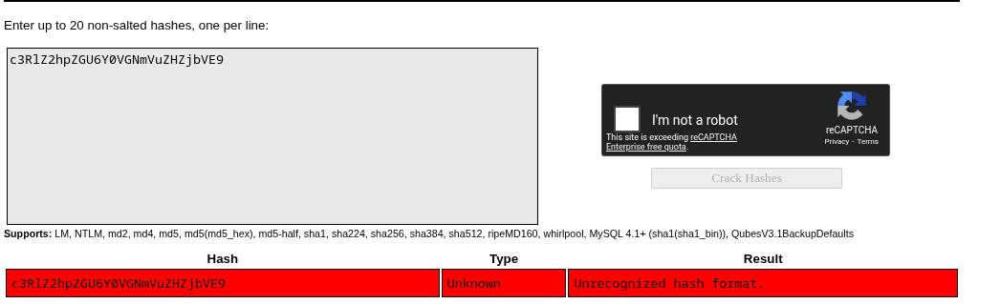
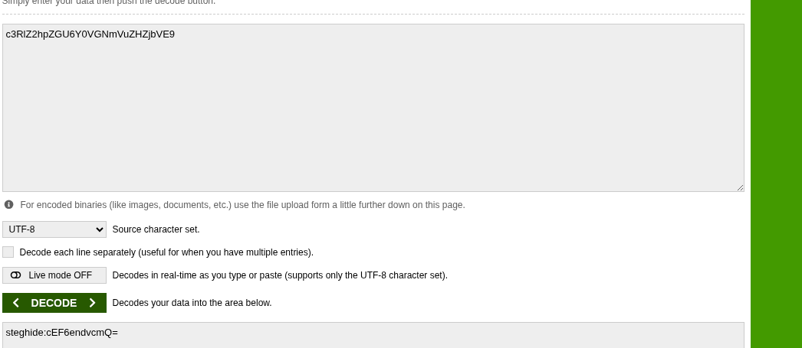
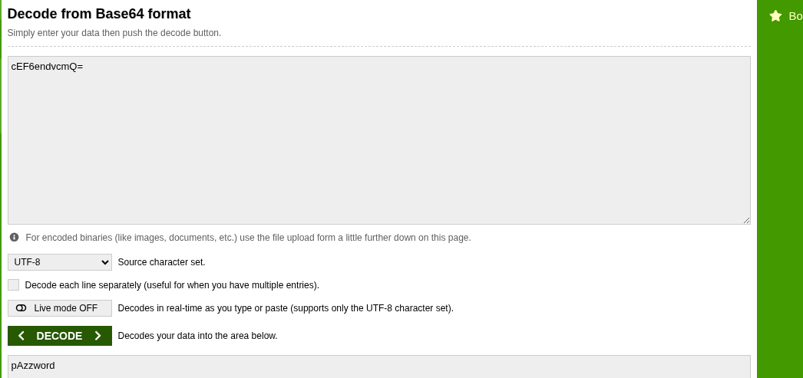
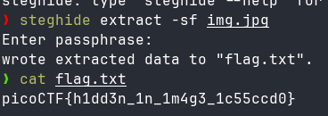

# 🚩 PicoCTF Writeup — [Hidden in plainsight]

> **Author:** [jhaienz]
> **Category:** [Forensics]
> **Difficulty:** [Easy]

---

## 📄 Challenge Description

You’re given a seemingly ordinary JPG image. Something is tucked away out of sight inside the file. Your task is to discover the hidden payload and extract the flag.

**Challenge URL:** `https://play.picoctf.org/practice/challenge/524`

---

## 🔍 Approach / Recon

noticed it was an image file, so i knew the flag is embeded into the image file.

---

## 🛠️ Tools Used

| Tool       | Purpose                           |
| ---------- | --------------------------------- |
| [ExifTool] | [image data extractor]            |
| [StegHide] | [Extract & Import files to image] |

---

## 🧩 Solution

### Step 1: [Title]

After downloading the image, I used exiftool to view the metadata of the image. After reading the data, I noticed the "comment"; it has a random string.

### Step 2:

I tried to crack the random string, but it did not work.

### Step 3:

I tried to paste it on a base64 decoder, and it successfully decoded the comment message, and the result said "steghide" and a base64 encrypted

---

### Step 4:

I decoded the base64 again, and it says "password."

---

### Step 5:

Now I used steghide to extract something, and it asked for a password, so I entered the password I got from the decoded message. It worked, and now I got the flag.

---

## 💡 Key Takeaways

I learned that every everytime there is an image, always read the metadata first by using ExifTool.

---

_Writeup by [jhaienz] — [Feb 16, 2026]_
