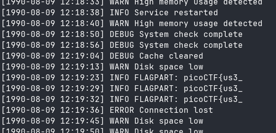
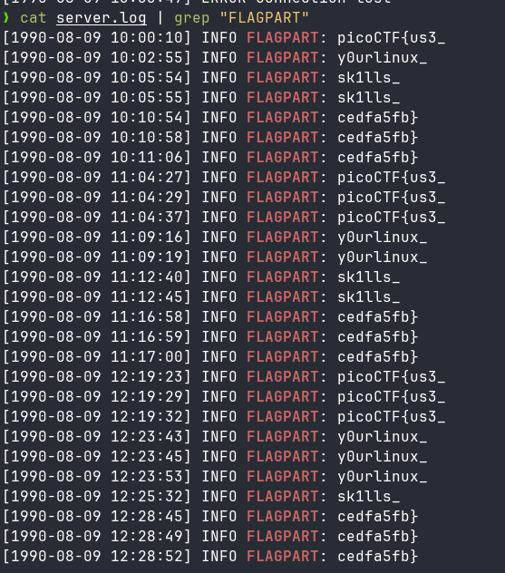

# 🚩 PicoCTF Writeup — [Log Hunt]

> **Author:** [jhaienz]
> **Category:** [General Skills]
> **Difficulty:** [Easy]

---

## 📄 Challenge Description

Our server seems to be leaking pieces of a secret flag in its logs. The parts are scattered and sometimes repeated. Can you reconstruct the original flag?
Download the logs and figure out the full flag from the fragments.

**Challenge URL:** `https://play.picoctf.org/practice/challenge/527`

---

## 🔍 Approach / Recon

Since I was given logs, it would be harder to deeply locate all of the scattered flags, since, based on the description, "The parts are scattered and sometimes repeated."

---

## 🛠️ Tools Used

| Tool   | Purpose                   |
| ------ | ------------------------- |
| [grep] | [searching text patterns] |

---

## 🧩 Solution

### Step 1: [Title]

The first thing I did was take a peek at the log file, and I got the first part of the flag.

### Step 2:

After getting the part of the flag, I saw that the log is "INFO FLAGPART," so I assumed the other part would be the same. Instead of manually finding the flag by manually looking for it, I used the Linux grep CLI tool to get all of the flags.

---

## 💡 Key Takeaways

I did learn some pattern recognition in here; always execute what's on your mind.

---

_Writeup by [jhaienz] — [feb 17, 2026]_
