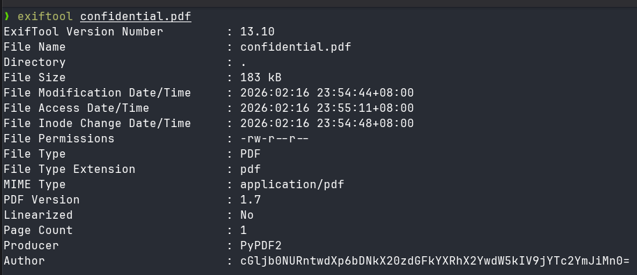
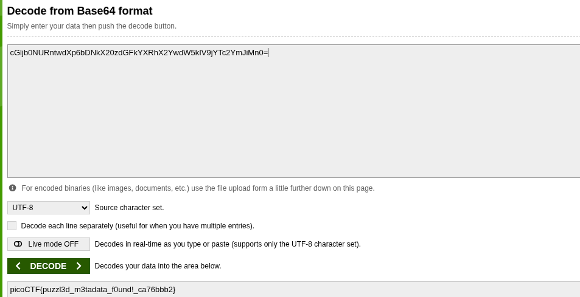

# 🚩 PicoCTF Writeup — [Riddle Registry]

> **Author:** [jhaienz]
> **Category:** [Forensics]
> **Difficulty:** [Easy]

---

## 📄 Challenge Description

Hi, intrepid investigator! 📄🔍 You've stumbled upon a peculiar PDF filled with what seems like nothing more than garbled nonsense. But beware! Not everything is as it appears. Amidst the chaos lies a hidden treasure—an elusive flag waiting to be uncovered.

**Challenge URL:** `https://play.picoctf.org/practice/challenge/530`

---

## 🔍 Approach / Recon

Noticed it was a pdf file, so I read first the metadata to see some clues to the flag

---

## 🛠️ Tools Used

| Tool       | Purpose              |
| ---------- | -------------------- |
| [ExifTool] | [Metadata Extractor] |

---

## 🧩 Solution

### Step 1:

I first used exiftool to read the metadata of the PDF file. I noticed at the very bottom there is an author, and the name is kind of suspicious. Who would name it this very long and with an = at the end? After seeing the = at the end, I assumed it was a base64 encoded message.

### Step 2:

After decoding the author, I now got the flag.

_Writeup by [jhaienz] — [Feb 16, 2026]_
